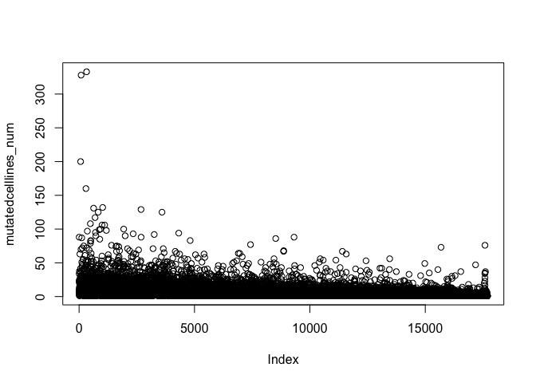
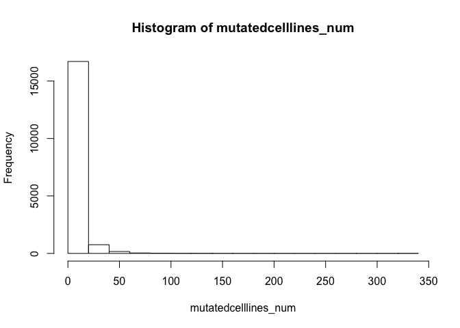
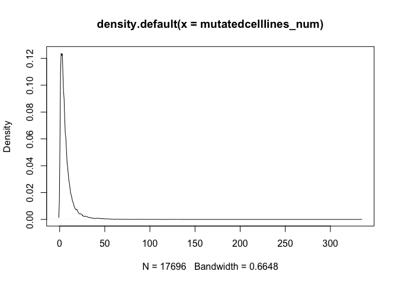
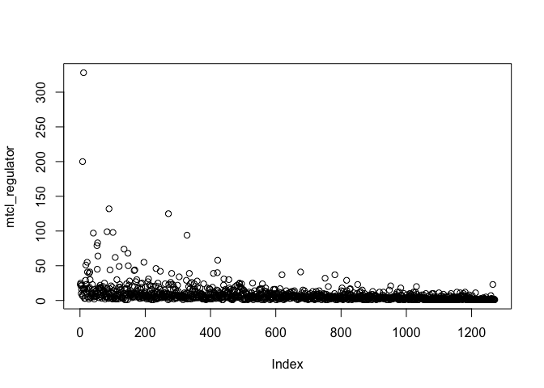
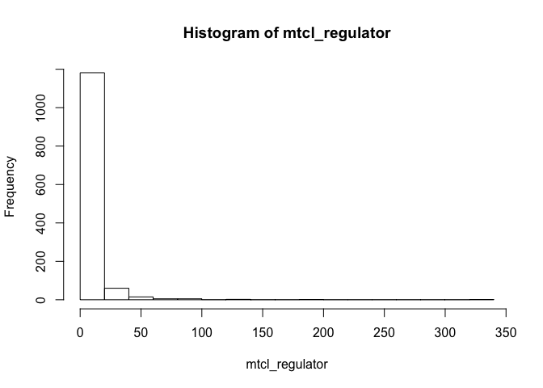
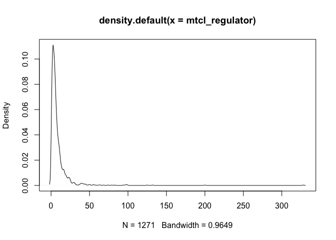

plot for regulator mutated cell lines
================

change a bit for regulators
---------------------------

Code here
---------

``` r
mutation_o<-read.delim('~/Desktop/work/data/CCLE/CCLE_DepMap_18Q1_maf_20180207 (1).txt')
mutation<-mutation_o
mutation_s<-mutation_o[which(is.na(mutation_o$ExAC_AF)),]
mutation_s<-mutation_s[which(mutation_s$isDeleterious == 'TRUE'),]
mutation_s_w<-mutation_s
mutation_s_w<-data.frame(mutation_s$Hugo_Symbol,mutation_s$Tumor_Sample_Barcode)
#library(reshape2)
genelist<-as.character(unique(mutation_s_w[,1]))
mutationlist<-as.character(mutation_s_w[which(mutation_s_w$mutation_s.Hugo_Symbol=='MTOR'),2])
rs<-function(x){
  c<-as.character(mutation_s_w[which(mutation_s_w$mutation_s.Hugo_Symbol==x),2])
  return(c)
  }
a<-lapply(genelist,rs)
names(a)<-genelist
mutatedcelllines<-a
b<-lapply(mutatedcelllines,length)
mutatedcelllines_num<-as.data.frame(b)
mutatedcelllines_num<-t(mutatedcelllines_num)
colnames(mutatedcelllines_num)<-c('freq')
plot(mutatedcelllines_num)
```



``` r
hist(mutatedcelllines_num)
```



``` r
plot(density(mutatedcelllines_num))
```



``` r
#mutatedcelllines_num[which(mutatedcelllines_num>50),]

regulator<-read.delim('~/Desktop/work/analysis/analysis_on_mutation/Gene_regulators/regulator classification.txt')
regulator<-regulator[,1]
regulator<-as.character(regulator)
regulator<-unique(regulator)

n<-row.names(mutatedcelllines_num)
mtcl_regulator<-mutatedcelllines_num[which(n%in%regulator),]

summary(mtcl_regulator)
```

    ##    Min. 1st Qu.  Median    Mean 3rd Qu.    Max. 
    ##    1.00    3.00    5.00    8.55    9.00  328.00

``` r
mtcl_regulator[mtcl_regulator>50]
```

    ##   KMT2D    TP53   PRKDC   LRRK2     NF1  CDKN2A  CREBBP SMARCA4   EP300 
    ##     200     328      51      55      97      79      83      64      99 
    ##     RB1   KMT2C  SETD1B   KMT2B     ATM    SPEN    PTEN  TNRC6B   ZFHX3 
    ##     132      98      62      74      68      55     125      94      58

stat plot
---------


