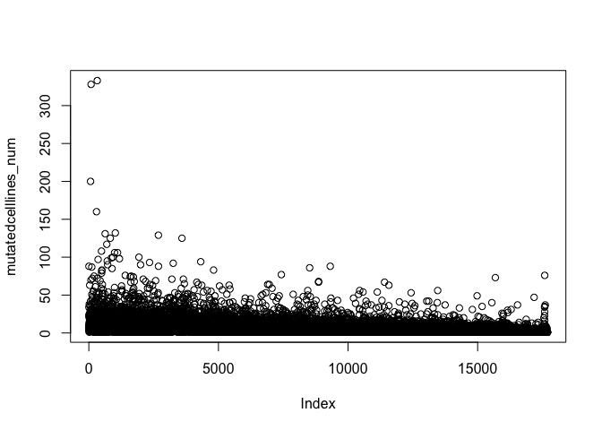
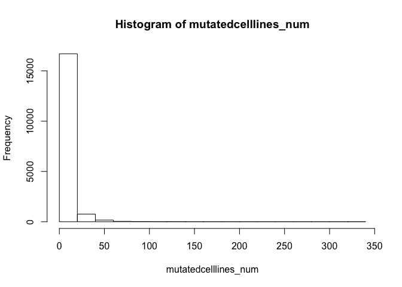
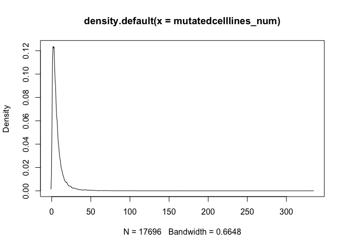

stat\_plot\_for\_mutated\_celllines\_github
================

Selection for the mutated cell lines
------------------------------------

``` r
mutation_o<-read.delim('~/Desktop/work/data/CCLE/CCLE_DepMap_18Q1_maf_20180207 (1).txt')
mutation<-mutation_o
mutation_s<-mutation_o[which(is.na(mutation_o$ExAC_AF)),]
mutation_s<-mutation_s[which(mutation_s$isDeleterious == 'TRUE'),]
mutation_s_w<-mutation_s
mutation_s_w<-data.frame(mutation_s$Hugo_Symbol,mutation_s$Tumor_Sample_Barcode)
genelist<-as.character(unique(mutation_s_w[,1]))
mutationlist<-as.character(mutation_s_w[which(mutation_s_w$mutation_s.Hugo_Symbol=='MTOR'),2])
rs<-function(x){
  c<-as.character(mutation_s_w[which(mutation_s_w$mutation_s.Hugo_Symbol==x),2])
  return(c)
  }
a<-lapply(genelist,rs)
names(a)<-genelist
mutatedcelllines<-a
b<-lapply(mutatedcelllines,length)
mutatedcelllines_num<-as.data.frame(b)
mutatedcelllines_num<-t(mutatedcelllines_num)
colnames(mutatedcelllines_num)<-c('freq')
```

Stat figures
------------



Note that the `echo = FALSE` parameter was added to the code chunk to prevent printing of the R code that generated the plot.



Note that the `echo = FALSE` parameter was added to the code chunk to prevent printing of the R code that generated the plot.



Note that the `echo = FALSE` parameter was added to the code chunk to prevent printing of the R code that generated the plot.
